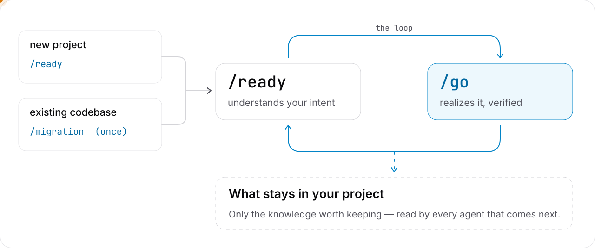

<a id="top"></a>

<div align="center">

<p>
<picture>
  <source media="(prefers-color-scheme: dark)" srcset="assets/readme/hero-dark.svg">
  <source media="(prefers-color-scheme: light)" srcset="assets/readme/hero-light.svg">
  
</picture>
</p>

<p>
<a href="https://github.com/prekuter/dryforge/actions/workflows/ci.yml"></a>
&nbsp;&nbsp;
<a href="https://github.com/prekuter/dryforge/releases"></a>
&nbsp;&nbsp;
<a href="https://github.com/prekuter/dryforge/stargazers"></a>
&nbsp;&nbsp;
<picture>
  <source media="(prefers-color-scheme: dark)" srcset="assets/readme/supported-dark.svg">
  <source media="(prefers-color-scheme: light)" srcset="assets/readme/supported-light.svg">
  
</picture>
</p>

<p>
  <a href="#install-and-update">설치</a> ·
  <a href="#getting-started">시작하기</a> ·
  <a href="https://dryforge.dev">웹사이트</a> ·
  <a href="./README.md">English</a>
</p>

</div>

<a id="install-and-update"></a>

# 설치 & 업데이트

<details>
<summary><b>Claude Code</b></summary>


설치:

```text
/plugin marketplace add prekuter/dryforge
/plugin install dryforge
```


업데이트:

```text
/plugin marketplace update dryforge
/plugin update dryforge@dryforge
```


**자동 업데이트:** 기본은 꺼져 있습니다. `/plugins` → installed → dryforge → auto-update에서 켤 수 있습니다.


</details>

<details>
<summary><b>Codex</b></summary>


설치:

```text
codex plugin marketplace add prekuter/dryforge
codex plugin add dryforge@dryforge
```


업데이트:

```text
codex plugin marketplace upgrade dryforge
```


**자동 업데이트:** 켜져 있습니다. 세션을 시작할 때 새 릴리스를 불러옵니다.


</details>

<details>
<summary><b>Grok Build</b></summary>


설치:

```text
grok plugin marketplace add prekuter/dryforge
grok plugin install dryforge --trust
```


업데이트:

```text
grok plugin update dryforge
```


**자동 업데이트:** 켜져 있습니다. 세션을 시작할 때 새 릴리스를 불러옵니다.


</details>

<details>
<summary><b>GitHub Copilot CLI</b></summary>


설치:

```text
copilot plugin marketplace add prekuter/dryforge
copilot plugin install dryforge@dryforge
```


업데이트:

```text
copilot plugin update dryforge
```


**자동 업데이트:** 기본은 꺼져 있습니다. `~/.copilot/settings.json`의 `extraKnownMarketplaces` 아래 dryforge 항목에 `"autoUpdate": true`를 넣으면 켜집니다.


</details>

<details>
<summary><b>Antigravity CLI</b></summary>


설치:

```text
agy plugin install https://github.com/prekuter/dryforge/tree/main/antigravity
```


업데이트:

```text
agy plugin install https://github.com/prekuter/dryforge/tree/main/antigravity
```


**자동 업데이트:** 지원하지 않습니다. 같은 설치 명령을 다시 실행하면 업데이트됩니다.


</details>

<a id="the-problem"></a>

# Everyone has been using agents wrong.

코딩 에이전트는 이미 일하는 법을 압니다. 모르는 건 당신의 의도입니다.

업계는 그 빈자리를 프로세스로 메웠습니다. 워크플로, 방법론, 규칙, 서브에이전트 떼. 전부 무엇을 만드는지 묻기도 전에 정해져 있습니다. 방법이 먼저 서고, 당신의 의도는 거기에 맞춰 깎입니다. 의도가 방법을 정해야 하는데, 방법이 의도를 정하고 있습니다.

> *"테스트부터 작성합니다. 그런데, 뭘 만드실 건가요?"*

순서가 거꾸로입니다. 의도가 분명해지면 방법은 거기서 따라 나옵니다. 방법부터 정하는 건 엄밀함이 아닙니다. 아무도 먼저 귀 기울이지 않았다는 뜻일 뿐입니다.

게다가 그 규칙들은 전부 당신의 일을 보기도 전에, 그때의 모델에 맞춰 쓰인 것입니다. 다음 모델이 나오면 규칙은 더 이상 맞지 않고, 구성 전체를 허물고 다시 짓습니다. 또다시.

- **워크플로**는 에이전트가 일하는 방식을 대본으로 짭니다. 그래서 새 모델이 나올 때마다 깨지고, 탓은 모델이 듣습니다.
- **테스트 우선을 철칙으로** 삼으면 설정 파일과 결제 규칙에 똑같은 의식을 치릅니다.
- **서브에이전트 떼**는 말하지 않은 의도를 동시에 추측하고, 그 토큰을 진척이라고 청구합니다.
- **루프**는 아무도 못 박지 않은 목표를 향해 몇 시간씩 돕니다.
- **질문**은 절차의 한 단계일 뿐입니다. 코드가 이미 답하는 걸 묻고, 정작 당신이 내려야 할 결정은 조용히 내려집니다. 가장 위험한 질문은 끝내 나오지 않은 질문입니다.
- **사람의 확인**은 당신만 내릴 수 있는 결정이 아니라 절차의 모든 단계에 걸립니다.
- **스펙 문서**는 의식을 위해 생성되고, 코드와 어긋나고, 결국 아무도 읽지 않습니다.

아무도 풀지 않은 문제는 맨 처음에 있었습니다. 당신이 실제로 무엇을 뜻하는지 이해하는 것입니다.

<a id="approach"></a>

# Fundamentally Different Approach

에이전트는 이제 진짜 자율을 맡겨도 될 만큼 강해졌습니다. 남은 질문은 맡길지 말지가 아니라, **무엇을** 맡길지입니다.

지금까지 답은 두 가지였고, 둘 다 틀렸습니다.

- **에이전트를 너무 조이면** 프로세스가 됩니다. 모든 단계를 대본으로 짜고, 모든 경우를 미리 나열합니다. 약한 모델은 받쳐 주지만 강한 모델은 가둡니다. 모델이 좋아질수록 절차가 더 발목을 잡습니다.
- **에이전트를 풀어 버리면** 순정 에이전트가 됩니다. 자유로워야 할 곳에서도, 자유로우면 안 되는 곳에서도 자유롭습니다. 당신이 무엇을 뜻했는지까지 스스로 정하고, 빈칸마다 그럴듯한 추측을 채웁니다.

dryforge의 답은 세 번째입니다. 당신의 의도에 닻을 내린 bounded autonomy. 에이전트는 스스로 옮길 수 없는 경계 안에서 완전한 자유를 가지고, 그 경계가 바로 당신의 의도입니다.

**에이전트는 지능이 모자라서 실패하는 경우가 드뭅니다.** 대부분은 추론 실패로 위장한 권한의 실패입니다. 아무도 말하지 않은 제품 규칙을 추측합니다. 지금 있는 코드를 원래 의도의 증거로 여깁니다. 요구 사항을 구현하기 쉬운 쪽으로 다시 해석합니다. 자기 요약을 일이 끝났다는 증거로 받아들입니다. 한 걸음씩 보면 다 그럴듯합니다. 그런데 모이면 결과가 당신이 원한 것에서 멀어집니다.

**그래서 dryforge는 권한을 나눴습니다.** bounded autonomy 위에, dryforge만의 권한 모델을 세웠습니다.

- 일 안의 모든 결정에는 주인이 있습니다. 당신이 내릴 결정은 어떤 모습으로 나타나든 당신에게 돌아옵니다. 에이전트가 내릴 결정은 에이전트가 가진 모든 것을 동원해 내립니다.
- 알아낼 수 있는 건 묻지 않습니다. 당신의 것은 절대 추측하지 않습니다.
- 출처끼리 어긋나면 아무것도 조용히 고르지 않습니다. 그 충돌은 당신에게 갑니다.
- 어떤 프로세스도 당신의 것을 정하지 않고, 당신의 것은 당신 없이 정해지지 않습니다. 추측할 바에는 멈추는 편이 낫습니다.

**나머지 설계는 여기서 나옵니다.**

- **천장이 아니라 바닥.** 반드시 지켜야 할 것만 고정하고, 추론은 열어 둡니다. 더 좋은 모델은 천장을 스스로 올립니다.
- **추론은 믿고, 자기 판정은 믿지 않는다.** 에이전트의 판단은 믿습니다. 다만 자기 일을 스스로 채점하게 두지는 않습니다. 끝났는지는 에이전트의 말이 아니라 증거가 정합니다.
- **노력은 비례한다.** 들이는 노력은 일의 위험에 따라 달라집니다. 작은 변경은 작게, 위험한 변경은 필요한 만큼 엄밀하게. 보여주기식 철저함은 미덕이 아니라 실패입니다.
- **대리 목표가 아니라 목적을 지킨다.** 하네스가 더하는 규칙, 체크리스트, 게이트는 모두 일 대신 에이전트가 최적화하는 대상이 될 수 있습니다. dryforge는 그 자체를 위한 장치를 하나도 더하지 않습니다. 가장 짧은 길이 당신의 의도에 닿는 길이 되도록 일을 짭니다.

**당신의 자리가 바뀝니다.** 모든 단계를 감독하거나, 모든 단계를 승인하거나, 코드가 알려 줄 수 있었던 걸 대신 답하지 않아도 됩니다. 당신이 결정해야 하는 곳에서만 당신을 부릅니다. 오직 거기서만. 만들어지는 것의 저자는 여전히 당신이고, 왜 그렇게 만들어졌는지 알고 있습니다.

경계가 움직이지 않으니, 그 안의 모든 것이 전력으로 돌 수 있습니다.

<a id="dryforge"></a>

# Definition of dryforge

dryforge는 첫 질문부터 증명된 결과까지 당신의 의도를 싣고 가며, 도중에 잃어버리지 않습니다.

스펙 우선, 테스트 우선, 병렬 에이전트 같은 의식의 묶음이 아닙니다. 그 안의 모든 것은 하나의 원칙에서 나옵니다. 그 결정이 누구의 것인가.

## Intent, understood

dryforge는 여기서 시작하고, 여기서 다른 모든 것과 갈라집니다.

가져온 것은 명령이 아니라 재료로 읽습니다. 자세한 문서라고 옳다고 가정하지 않고, 거친 메모라고 추측할 핑계로 삼지도 않습니다. 당신이 한 말은 당신이 뜻하지 않은 무언가로 슬쩍 바뀌지 않습니다.

그다음 대부분의 도구는 서식처럼 묻습니다. 정해진 목록을, 한 칸씩, 절차가 필요로 하는 순서대로. 아니면 아예 묻지 않고 추측합니다. dryforge는 모든 걸 먼저 읽은 시니어 엔지니어처럼 묻습니다.

당신이 무엇을 하려는지 더 많이 이해할수록 덜 묻습니다. 당신의 말, 가져온 자료, 코드가 이미 분명히 한 것은 스스로 정리하고, 다시 묻지 않습니다.

중요한 것은 대부분 말해지지 않습니다. 그래서 당신이 언급하지 않은 부분까지 생각하고, 당신이 결정해야 할 것만 묻습니다. 절차에 질문 단계가 있어서가 아니라, 그 결정이 당신의 것이기 때문입니다.

- 원하는 것에 관한 질문은 곧바로 당신에게 갑니다.
- 당신의 결정이지만 기술적인 것이면, 선택지와 추천을 함께 가져옵니다. 엔지니어가 아니어도 고를 수 있게.
- 입력이 얇을수록 더 깊게 묻습니다. 한 줄 아이디어에 한 줄짜리 설계가 돌아오지 않습니다.

당신의 것은 조용히 정해지지 않습니다. 당신 대신 정한 것이 있다면, 승인하기 전에 따로 표시해 알립니다.

당신은 당신의 몫인 질문에만 답하고, 그 하나하나가 중요합니다. 대화는 끝나도 의도는 끝나지 않습니다. 대화 없이도 홀로 설 수 있게 기록됩니다.

## Intent, realized

승인한 것은 당신이 뜻한 그대로 실행됩니다. 더 쉬운 버전으로 바뀌지 않고, 돌아가기만 하는 코드에서 멈추지도 않습니다. 도중에 현실이 부딪혀 오면, dryforge는 의도를 거기에 맞춰 구부리지 않습니다. 당신에게 돌아옵니다.

일에는 필요한 만큼의 구조만 붙습니다. 테스트, 병렬 작업, 격리, 독립 리뷰 모두 있습니다. 일이 요구할 때만 쓰고, 의식으로 쓰지 않습니다. 바빠 보이려고 띄우는 에이전트는 없습니다.

끝났다는 건 검증됐다는 뜻이고, 그 검증은 실제로 돌아간 것이어야 합니다. 돌지 못한 검증은 통과가 아니라 실패입니다.

프로젝트에 다시 기록되는 것에는 당신이 정한 것과 실제로 만들어진 것이 함께 담깁니다.

## Intent, kept

무엇을 정했고 왜 그랬는지가 프로젝트에 남습니다. 루프가 한 바퀴 돌 때마다 이전 바퀴가 정리한 모든 것에서 시작하니, 프로젝트가 자랄수록 질문은 날카로워지고 줄어듭니다. 오래 쓸수록 당신의 프로젝트를 더 잘 압니다.

도구 안이 아니라 저장소 안에 평범한 문서로 남습니다. 에이전트를 바꿔도 프로젝트가 따라옵니다.

지금 쓰는 에이전트에 그대로 붙고, 어떤 모델에도 맞춰져 있지 않습니다. 하나의 스킬 소스가 Claude Code, Codex, Grok Build, GitHub Copilot CLI, Antigravity CLI에서 돌고, 에이전트를 하나 더하는 데는 패키징만 필요했습니다.

<a id="getting-started"></a>

# 시작하기

## 명령어

<picture>
  <source media="(prefers-color-scheme: dark)" srcset="assets/readme/loop-dark.svg">
  <source media="(prefers-color-scheme: light)" srcset="assets/readme/loop-light.svg">
  
</picture>

<!-- demo: vanilla agent vs dryforge (GIF) -->

새 프로젝트는 `ready`로 시작합니다. 이미 있는 코드베이스는 `migration`으로 한 번 들여옵니다. 그다음부터는 `ready`와 `go`가 루프의 전부입니다. 배울 워크플로도, 설정할 것도 없습니다. 언제나 당신의 몫인 순간은 두 번입니다. 무엇이든 만들기 전에 의도를 승인할 때, 그리고 결과를 받아들일 때.

어떤 언어로 쓰든 그 언어로 일하고, 질문을 마치면 결과를 낼 때까지 조용히 일합니다. 잘못된 가정의 대가가 큰 곳에 쓰세요. 새 프로젝트, 기능, 코드베이스를 가로지르는 변경. 작고 이미 분명한 수정에는 필요 없습니다.

`/ready`, `/go`, `/migration`으로 호출합니다. Codex에서는 접두사가 `$`입니다: `$ready`, `$go`, `$migration`.

### ready

```text
/ready <무엇이든>
```

가진 것을 그대로 가져오세요. 한 줄 아이디어, 브레인스토밍, 애매한 스펙, PDF, 다른 도구가 쓴 계획, 아니면 이것들을 한꺼번에. 생각을 정리해서 가져올 필요도, 형식에 맞출 필요도 없습니다.

ready는 프로젝트를 읽고, 당신이 무엇을 뜻하는지 파악하고, 당신에게서 필요한 것만 묻습니다. 열린 결정이 모두 정리되면 승인할 결과를 건넵니다. `.dryforge/` 아래에 평범한 Markdown으로 적힌, 당신 컴퓨터에만 있는 당신의 의도입니다. 승인하기 전에는 아무것도 만들지 않습니다. 승인한 뒤 같은 세션에서 `go`를 실행하세요. 그 전에 세션이 끝나도, 새 세션에서 `/go`가 `.dryforge/`의 승인된 의도를 이어받습니다.

아직 저장소가 없나요? ready가 만들자고 제안합니다.

### go

```text
/go
```

승인한 것을 실현하고 검증합니다. 결과와 진짜 blocker가 있을 때만 말하고, 일이 당신이 요청한 것을 바꾸게 되면 멈추고 묻습니다. 일이 끝나면 결과와 프로젝트 문서에서 바뀐 것을 보고합니다.

저장소는 당신의 것입니다. 새 프로젝트는 main에서 바로 만듭니다. 기존 프로젝트는 별도 브랜치에서 작업하고, 끝나면 어떻게 합칠지 묻습니다. merge, pull request, 아니면 그대로 두기. 절대 스스로 merge하지 않습니다.

### migration

```text
/migration
```

코드는 무엇이 만들어졌는지 보여줄 뿐, 무엇을 뜻했는지는 보여주지 않습니다. 권한 검사가 있다는 건 증명해도, 그 검사가 정책의 전부라는 건 증명하지 못합니다.

migration은 코드베이스를 읽고 스스로 알아낼 수 있는 것을 먼저 알아냅니다. 그리고 코드가 말해 주지 못하는 것을 묻습니다. 비즈니스 규칙, 보안 정책, 무엇이 의도된 것이고 무엇이 그냥 남은 흔적인지. 기존 문서는 믿지 않고 따져 보며, 무엇을 남기고 무엇을 버렸는지 이유와 함께 알려 줍니다.

프로젝트 문서를 쓰고, 커밋은 당신에게 맡깁니다. 이미 CLAUDE.md나 AGENTS.md가 있다면 함께 검토하고, 백업한 뒤, 당신의 승인을 받아 다시 씁니다. 한 번 실행하고, 커밋하고, 새 세션을 여세요. 그다음부터 프로젝트는 `ready` → `go` 루프 안에서 삽니다.

## 프로젝트에 남는 것

```text
your-project/
├── CLAUDE.md                 # Claude Code가 가장 먼저 읽는 곳
├── AGENTS.md                 # Codex와 다른 에이전트가 가장 먼저 읽는 곳
├── docs/
│   ├── architecture.md       # 시스템이 어떻게 맞물리는지
│   ├── business-rules.md     # 제품이 어떻게 동작해야 하는지
│   ├── security.md           # 누가 무엇을 할 수 있고, 무엇을 지키는지
│   ├── standards.md          # 깨지면 안 되는 규칙
│   ├── engineering-notes.md  # 함정과, 코드만으로는 안 보이는 메커니즘
│   ├── operations.md         # 설치, 빌드, 배포
│   ├── contracts.md          # 무엇이 들어오고 나가는지
│   └── tracking/             # 프로젝트가 어디쯤 있는지, 그리고 그 뒤의 결정들
└── <module>/AGENTS.md        # 코드베이스 각 부분의 지역 규칙
```

루프가 한 바퀴 돌 때마다 프로젝트의 의도가 기록으로 남습니다. 결정, 이유, 코드로는 보이지 않는 규칙. 중요한 것만 남습니다. 매번 손댄 부분을 코드와 맞추기 때문에, 쌓일수록 부풀지 않고 선명해집니다. 다음 `ready`는 거기서 시작합니다.

평범한 Markdown이고, 당신이 쓰는 언어로 쓰이며, 코딩 에이전트가 이미 읽는 진입점에 놓입니다. 문서는 dryforge가 아니라 당신의 프로젝트를 설명합니다. 어떤 에이전트든, 어떤 세션이든 이 문서에서 일합니다. dryforge가 있든 없든. 플러그인을 지워도 남습니다.

dryforge는 부를 때만 움직입니다. 남긴 것은 늘 일합니다.

각 작업의 기록은 `.dryforge/` 아래, 당신 컴퓨터에만 남습니다. 중요한 것은 `docs/`로 옮겨져 다른 작업물과 함께 저장소에 들어갑니다.

# 요구 사항

> [!IMPORTANT]
> Git이 필요합니다. `go`를 실행하기 전에 작업 트리가 깨끗해야 합니다. `.dryforge/` 밖의 변경과 새 파일이 모두 커밋돼 있어야 하고, main 브랜치가 원격을 추적한다면 모든 커밋이 push돼 있어야 합니다.

# 라이선스

[GNU Affero General Public License v3.0 only](LICENSE) (`AGPL-3.0-only`).

<br />

<div align="center">


<sub><a href="#top">back to top</a> · <a href="https://dryforge.dev">dryforge.dev</a> · © 2026 prekuter · AGPL-3.0-only</sub>

</div>
